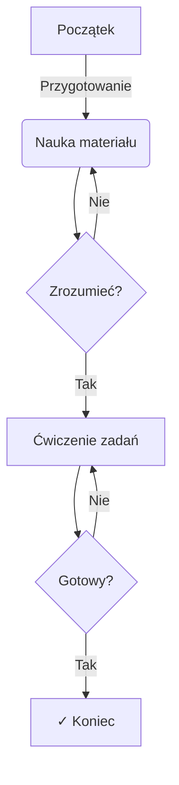
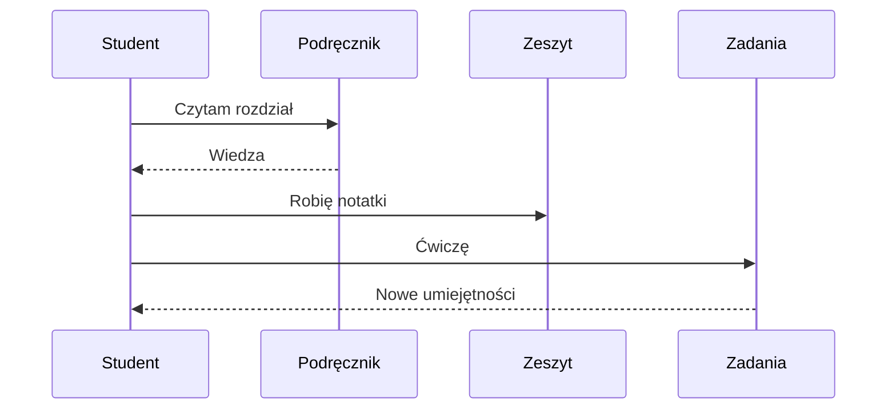

# Przykłady Diagramów i Formatowania

Na tej stronie znajdują się przykłady różnych elementów, które możesz stosować w swoich notatkach.

## Diagramy Mermaid

### Flowchart - Przykład Procesu

### Diagram Sekwencji

## Formatting Tekstu

Możesz używać:
- **Tekst pogrubiony** dla ważnych pojęć
- *Tekst pochylony* dla podkreślenia
- `kod` dla zmiennych i kodu
- [Linki](https://example.com) do innych zasobów

## Listy

### Lista nieuporządkowana
- Element 1
- Element 2
- Element 3

### Lista uporządkowana
1. Pierwszy krok
2. Drugi krok
3. Trzeci krok

## Tabele

| Przedmiot | Semestr | Ocena |
|-----------|---------|-------|
| Analiza   | 1       | 4.0   |
| Algebra   | 1       | 3.0   |
| Programowanie | 1   | 5.0   |